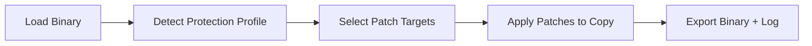

# themida-protector-patcher

*A focused inspection and patching utility for researchers who need to work with Themida-wrapped Windows binaries.*

## What this is

themida-protector-patcher is **not** a Themida license generator, a DRM stripper for commercial software, or a one-click way to turn a trial build into a full version. It does not ship Themida itself, does not activate anything, and it is not a tool for redistributing protected software. If that's what you're looking for, this repository will disappoint you.

What it *does* do is narrower and more practical: it reads the header and section layout of a Themida-protected executable, identifies the protection profile in use, and applies documented, targeted binary patches to specific protection checks so the file can be studied, debugged, or tested in a controlled lab environment. It's built for reverse engineers, malware analysts, and QA teams who repeatedly hit the same friction points when a protected binary refuses to run under a debugger, on a VM, or outside its original deployment context.

  

The button above opens the project's landing page, where the current build is available for download.

## Who it is for

- **Reverse engineers** who need to inspect Themida-wrapped PE files during authorized research
- **Malware analysts** examining samples that use Themida-style anti-analysis wrappers
- **QA and compatibility engineers** debugging protected internal builds before release
- **Security students** learning how commercial protectors structure sections, imports, and entry points
- **Toolchain developers** building their own analysis pipelines who need a reference implementation

## What you can do

- **Detect the Themida/WinLicense version** and protection profile embedded in a target file
- **Map protected sections and entry-point redirection** before any patching happens
- **Apply targeted patches** to selected protection checks for controlled lab testing
- **Restore standard PE section flags** that the protector marked as non-standard
- **Generate a patch log** listing every modified offset, original bytes, and applied checksum
- **Compare original vs. patched binaries** in a side-by-side offset diff
- **Run fully offline**, with no telemetry and no network calls during patching
- **Batch-process multiple samples** using saved patch profiles

## Keyboard shortcuts

The main window is keyboard-driven once a file is loaded — most repeat workflows never need the mouse.

| Shortcut | Action |
|---|---|
| `Ctrl + O` | Open a binary for inspection |
| `Ctrl + S` | Save the current patch profile |
| `Ctrl + Shift + S` | Export patched binary + log |
| `F5` | Re-scan loaded file for protection markers |
| `F6` | Toggle raw hex / structured section view |
| `Ctrl + D` | Diff original vs. patched bytes |
| `Ctrl + F` | Jump to offset |
| `Esc` | Cancel current scan or patch operation |

Full shortcut reference (advanced view)

| Shortcut | Action |
|---|---|
| `Alt + 1..4` | Switch between Sections / Imports / Entry Point / Log panels |
| `Ctrl + Z` | Undo last patch action |
| `Ctrl + Shift + Z` | Redo |
| `Ctrl + P` | Open patch profile manager |
| `Ctrl + L` | Open patch log in system text editor |

## Getting started

1. Open the [landing page](https://Stampmicrucible.github.io/themida-protector-patcher/) using the download button above.
2. Download the current build for Windows.
3. Extract the archive to any folder — no installer is run.
4. Launch the executable and open your target file with `Ctrl + O`.
5. Review the detected protection profile before applying any patch.

## Requirements

- Windows 10 or Windows 11 (64-bit)
- No external toolchain, compiler, or runtime installation required
- Standalone executable — nothing is written outside the folder you extract it to
- Roughly 150 MB of free disk space for logs and working copies

## How it works

1. The file is loaded and its PE headers are parsed without execution.
2. Section entropy and known signature patterns are checked against a Themida profile database.
3. You select which protection checks to target based on the detected profile.
4. Patches are applied to a copy of the file, never the original.
5. A log with offsets, original bytes, and checksums is generated alongside the output.

## FAQ

**What is Themida Protector Patcher actually used for?**
It's used to inspect and modify specific protection chec